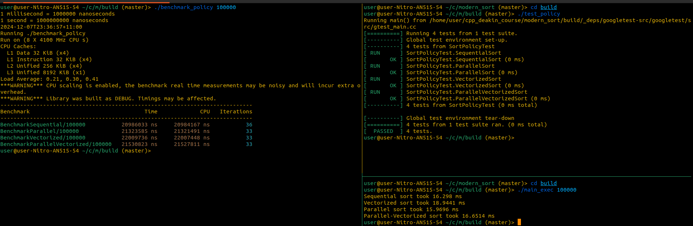

# Execution Policy Sorting Example

This project demonstrates the use of various execution policies in C++17 to enhance the performance of sorting algorithms. The sorting operations are executed using different policies: Sequential, Vectorized, Parallel, and Parallel-Vectorized. The project includes Google Test for unit testing and Google Benchmark for performance measurement.

## Execution Policies Explained

### 1. **Sequential (`std::execution::seq`)**

The `sequential_policy` performs the sorting algorithm in a single thread, processing elements in order without parallelism.
This is the traditional way to sort a collection, ensuring the algorithm is deterministic and simple.

**When to use:**  

- Small datasets where the overhead of parallelism or vectorization might outweigh the benefits.

### 2. **Vectorized (`std::execution::unseq`)**

The `unsequenced_policy` enables vectorization, allowing the CPU to process multiple data elements in parallel within a single instruction cycle. This takes advantage of SIMD (Single Instruction, Multiple Data) instructions, which can significantly improve performance on supported hardware.

**When to use:**  

- Modern CPUs with SIMD support.
- Large datasets where vectorization provides substantial performance improvements.

### 3. **Parallel (`std::execution::par`)**

The `parallel_policy` enables multi-threading, distributing the sorting work across multiple processor cores. This can lead to substantial performance improvements on multi-core systems, especially for large datasets.

**When to use:**  

- Multi-core systems where dividing the sorting task into parallel tasks can speed up the operation.
- Datasets large enough that parallelism overcomes the overhead of managing threads.

### 4. **Parallel-Vectorized (`std::execution::par_unseq`)**

The `parallel_unsequenced_policy` combines both parallelism and vectorization. This policy splits the sorting work across multiple threads while also leveraging SIMD instructions within each thread. This is ideal for maximizing performance on modern, multi-core CPUs with SIMD support.

**When to use:**  

- Multi-core processors with SIMD support.
- Very large datasets where both parallelism and vectorization are beneficial.

## Building the Project

### Prerequisites

- CMake 3.10 or higher
- A C++20 compatible compiler (e.g., GCC, Clang)
- Google Test and Google Benchmark (automatically fetched during build)

### Steps to Build

1. Clone the repository and navigate to the project directory:

    ```bash
    git clone <repo_url>
    cd <project_directory>
    ```

2. Create a `build` directory:

    ```bash
    mkdir build
    cd build
    ```

3. Run CMake to configure the project and generate build files:

    ```bash
    cmake ..
    ```

4. Build the project:

    ```bash
    make
    ```

## Running the Project

After building the project, you can run the executables directly to check the sorting performance and test the algorithms.

```bash
./main_exec <vector_size>
```

### Running the Benchmark

To run the benchmarks, which measure the performance of sorting using different execution policies, execute the `benchmark_policy` executable:

```bash
./benchmark_policy <vector_size>
```

Where `<vector_size>` is the size of the vector to be sorted (e.g., `100000`).

This will output the sorting time for each policy in nanoseconds.

### Running the Tests

The tests verify the correctness of the sorting algorithms for each policy. To run the tests, execute the `test_policy` executable:

```bash
./test_policy
```

This will ensure that the sorting algorithms are working correctly and produce the expected sorted results.

### Using CTest for Testing

While `ctest` can be used to run the tests, it is recommended to use it with the `-R` option to specify a particular test, such as `TestExecutionPolicy`, to avoid unnecessary output:

```bash
ctest -R TestExecutionPolicy
```

Running `ctest` without the `-R` option will execute all tests, including those not relevant to execution policy tests, generating a lot of output that can be overwhelming.

## Benchmark Output Interpretation

The benchmark results are provided in nanoseconds for accuracy. For example:

```bash
BenchmarkSequential/100000       19303581 ns     19302533 ns           37
BenchmarkParallel/100000         19349399 ns     19348013 ns           37
BenchmarkVectorized/100000       19538364 ns     19537099 ns           37
BenchmarkParallelVectorized/100000 19447180 ns     19445979 ns           37
```

- **Time**: Total Time taken to sort using the respective policy.
- **CPU**: Time spent by the CPU on sorting.
- **Iterations**: Number of iterations performed for benchmarking.

## Why Sequential Might Be Faster on Some Architectures

Even though parallel and vectorized execution policies can improve performance on multi-core, SIMD-supported CPUs, the sequential policy can sometimes be faster, especially on certain architectures:

1. **Small Datasets**: For small datasets, the overhead of managing threads and vectorization can outweigh the performance benefits. Sequential sorting is faster because it avoids this overhead.

2. **Non-SIMD-Friendly Architectures**: On certain CPUs without advanced SIMD or multi-core optimizations, parallel and vectorized policies may not provide any benefits, or they might even result in slower performance due to the overhead of managing multiple threads and vectorization operations.

## Example Output


